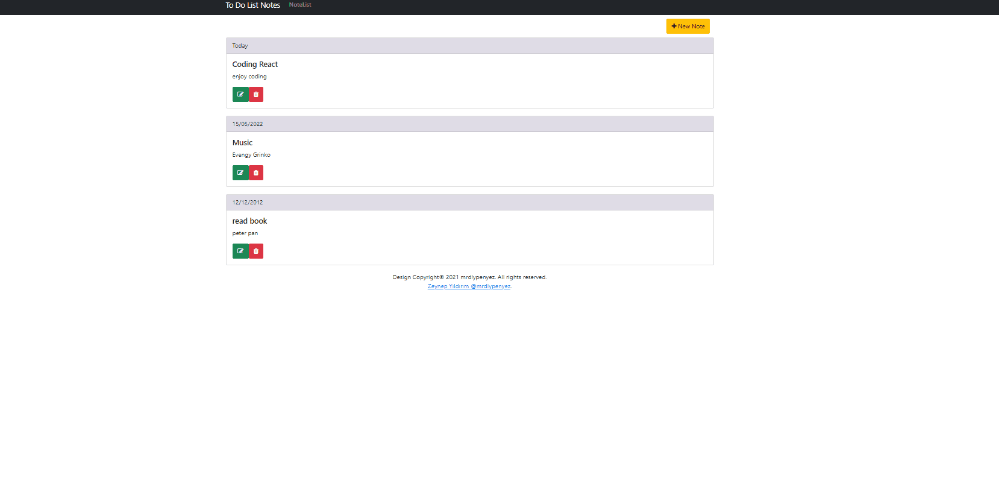

# Getting Started with To Do List Projects

An application created with React, JavaScript and CSS to add, delete, update and track notes according to user preference.

## User Interface

   


## Using

Clone down this repository. You will need node and npm installed globally on your machine.

```js
npx json-server --watch -p 3333 db.json
```
```js
npm start
```
